# MCP Server Secured with PingFederate

Cloudflare Workers MCP server secured with PingFederate. This MCP server enables AI agents (MCP clients) to call a protected API on behalf of an authenticated end user.

### Stack

| Role | Name | Description |
| :--- | :--- | :--- |
| **Platform** | [Cloudflare Workers](https://workers.cloudflare.com) | Serverless execution |
| **Framework** | [Hono](https://hono.dev) | Lightweight API endpoints |
| **Agent Execution** | [Cloudflare Agents SDK](https://developers.cloudflare.com/agents) | Base class for implementing the stateful MCP server |
| **Session State** | [Cloudflare Durable Objects](https://developers.cloudflare.com/durable-objects) | Provides stateful, isolated storage for each MCP connection |

### Requirements

* Node.js (v20+)
* PingFederate server
* Cloudflare account & [Wrangler CLI](https://developers.cloudflare.com/workers/wrangler/install-and-update)
* [Todo API](../api) deployed

### Structure

```text
mcp/
├── package.json               # Dependencies and scripts
├── tsconfig.json              # TypeScript compiler settings
├── wrangler.jsonc             # Worker configuration
└── src/
    ├── index.ts               # Defines the HTTP interface, handling MCP server discovery and MCP server routing
    ├── mcp.ts                 # Stateful MCP server as a cloudflare McpAgent (durable object)
    ├── config.ts              # Worker bindings and durable object session data
    ├── auth.ts                # Manages auth middleware and executes token exchange (delegation grant)
    └── todoApi.client.ts      # HTTP client to the downstream Todo API
```

## 🔒 PingFederate Configuration

### Part 1: Core Identity and Authentication Flow

This phase configures the login method (IdP Adapter), defines the user identity structure (Policy Contract), and links them together via the Authentication Policy.

#### 1.1 Configure the IdP Adapter

The adapter defines the authentication method, looks up session information, and provides user identification for policy use.

- From the PingFederate console: navigate to Authentication $\rightarrow$ Integration $\rightarrow$ IdP Adapters
- Type: HTML Form IdP Adapter

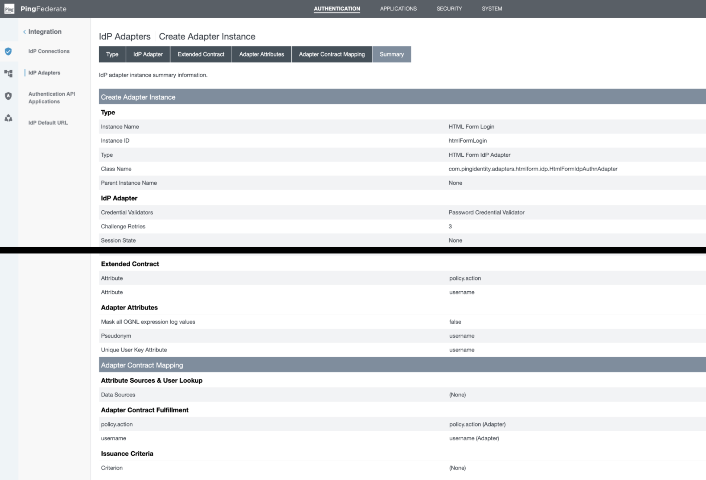

#### 1.2 Configure the Policy Contract

Defines the standardized attributes that PingFederate uses internally.

- From the PingFederate console: navigate to Authentication $\rightarrow$ Policies $\rightarrow$ Policy Contracts

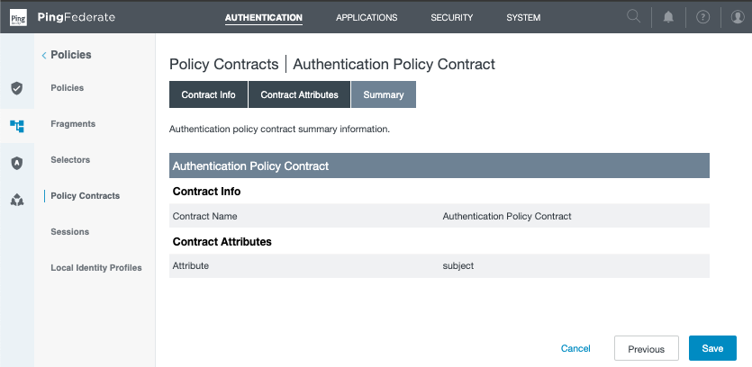

#### 1.3 Configure the Authentication Policy

The policy links the IdP adapter (step 1.1) to the policy contract (step 1.2).

- From the PingFederate console: navigate to Authentication $\rightarrow$ Policies $\rightarrow$ Policies

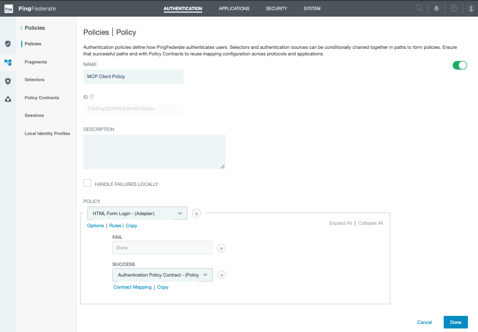

### Part 2: OAuth Configuration and Subject Token Issuance

This phase configures the core OAuth components for the MCP client. It covers scope definitions, access token management, persistent grant mappings, and OIDC policy configuration.

#### 2.1 Define Required OAuth Scopes

Define the necessary scopes that the MCP client will request, enabling granular access control for downstream APIs.

- From the PingFederate console: navigate to System $\rightarrow$ OAuth Settings $\rightarrow$ Scope Management

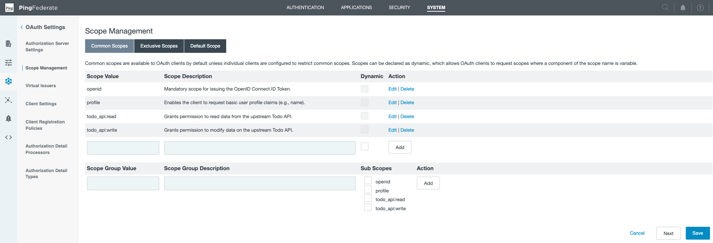

#### 2.2 Configure an Access Token Manager for the Subject Token

This ATM defines the specific properties of the token that the MCP client will present when requesting resources from the MCP server.

- From the PingFederate console: navigate to Applications $\rightarrow$ OAuth $\rightarrow$ Access Token Management
- **Type:** JSON Web Token
- **Resource URI:** URI of the MCP server
- **Access Token Attribute Contract:**
    - Set the subject attribute name to `USER_KEY`
    - Extend the contract to include `aud`, `scope`, and `sub`

#### 2.3 Establish Persistent Grant Data (Policy Contract Mapping)

This step dictates which attributes from the authenticated user's policy contract are stored persistently, creating reusable grant data required for subsequent token issuance and exchange operations.

- From the PingFederate console: navigate to Authentication $\rightarrow$ OAuth $\rightarrow$ Authentication Policy Contract Grant Mapping

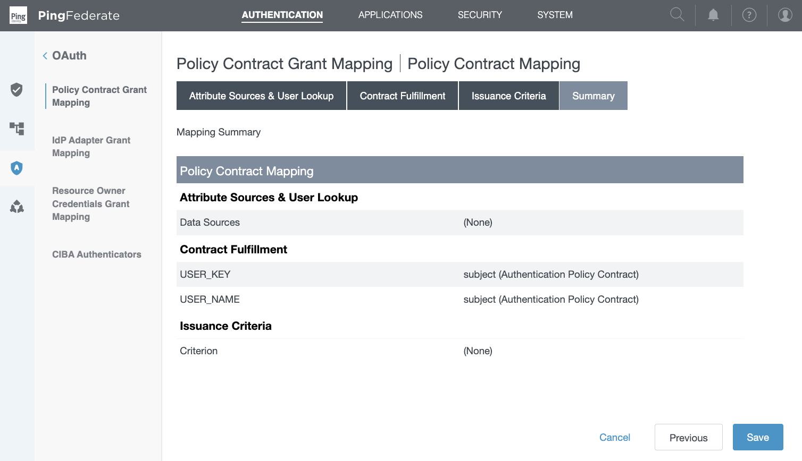

#### 2.4 Define the Subject Token's Content Mapping

This defines the final claims of the subject token by retrieving and mapping attributes from the persistent grant (established in Step 2.3) into the token's attribute contract.

- From the PingFederate console: navigate to Applications $\rightarrow$ OAuth $\rightarrow$ Access Token Mappings

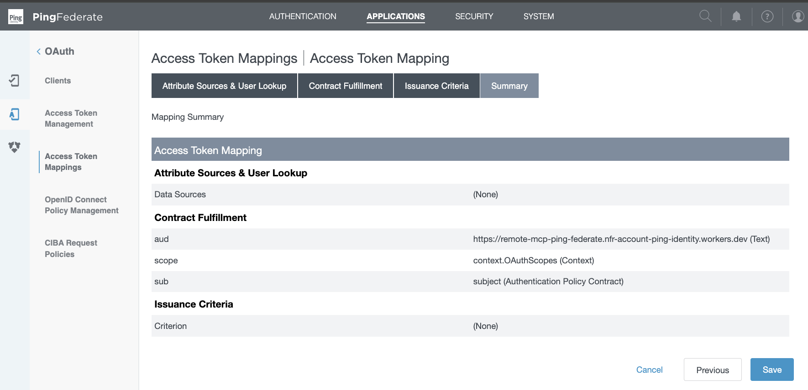

#### 2.5 Configure OIDC Policy Management for the MCP Client

Defines the structure of the ID Token. It maps attributes directly from the Access Token Manager (step 2.2) into the standard OIDC claims required by the client.

- From the PingFederate console: navigate to Applications $\rightarrow$ OAuth $\rightarrow$ OpenID Connect Policy Management

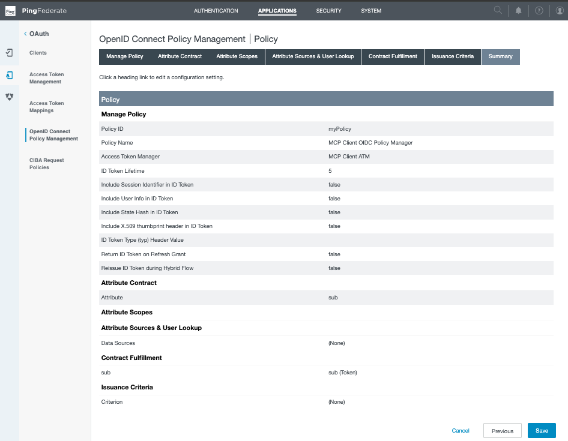

#### 2.6 Enable Dynamic Client Registration (DCR) for MCP Client Onboarding

This step allows MCP clients to register automatically. The client uses the authorization server metadata to determine registration details.

- From the PingFederate console: navigate to System $\rightarrow$ OAuth Settings $\rightarrow$ Client Settings

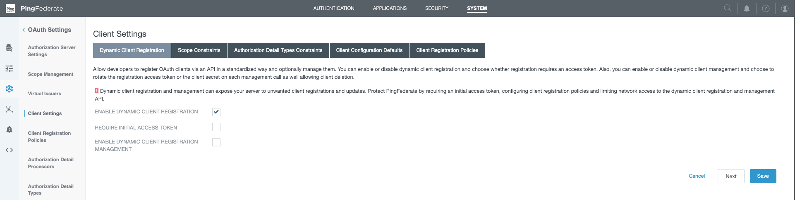

> [!NOTE]
> Dynamic client registration requires OAuth client storage in an external datastore, such as a database or LDAP directory. If you have not yet switched from the default on-disk client storage to an external datastore, see [OAuth client datastores](https://docs.pingidentity.com/pingfederate/12.3/administrators_reference_guide/pf_oauth_client_datastore.html).

### Part 3: MCP Server Token Exchange (Delegation)

This phase configures the MCP server to perform token exchange, swapping the subject token for a token that can be used to call a downstream API.

#### 3.1 Create the Token Exchange Token Processor

This processor validates the incoming subject token and extracts the claims that will be available to the TEPP.

- From the PingFederate console: navigate to Authentication $\rightarrow$ Token Exchange $\rightarrow$ Token Processors

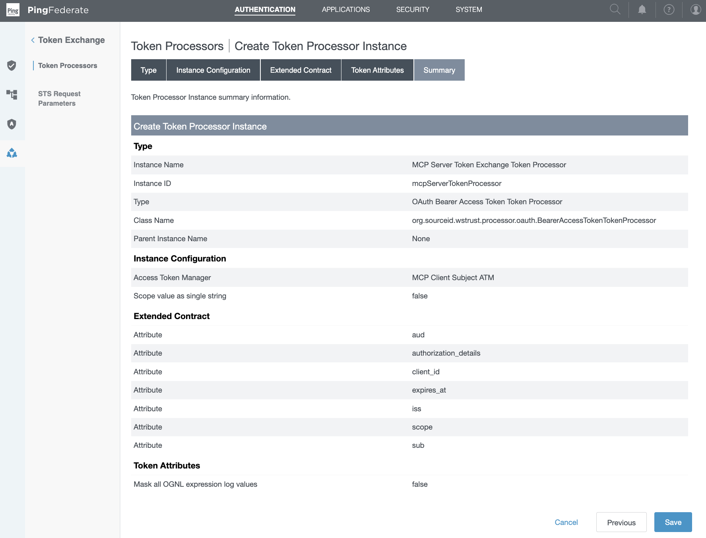

#### 3.2 Create the Token Exchange Processor Policy (TEPP)

This policy governs the token exchange grant type, enabling the MCP server to request token swaps. It establishes the attribute contract that determines how data is transferred during the exchange.

- From the PingFederate console: navigate to Applications $\rightarrow$ Token Exchange $\rightarrow$ Processor Policies

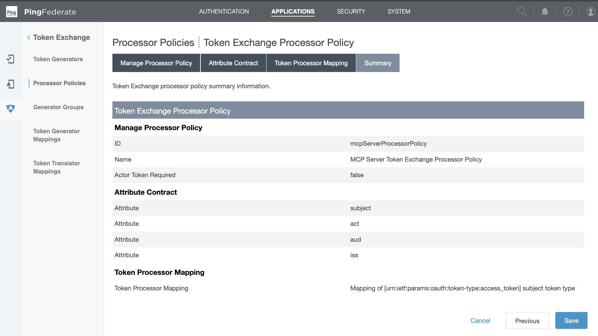

#### 3.3 Create the Token Processor Mapping

This mapping associates the specific subject token type with the Token Processor instance created in Step 3.1. It also defines the contract fulfillment, mapping the claims extracted from the subject token to the required attributes of the TEPP.

- From the PingFederate console: navigate to Applications $\rightarrow$ Token Exchange $\rightarrow$ Processor Policies $\rightarrow$ Token Processor Mapping

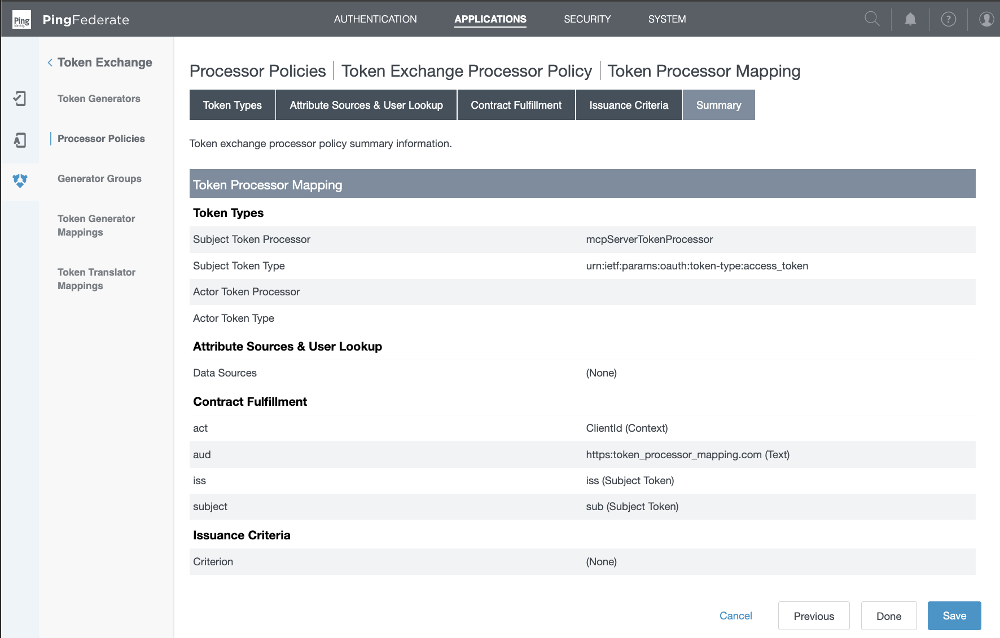

#### 3.4 Configure an Access Token Manager for the Downstream API

This ATM defines the format and signing of the outgoing token—the new token that the MCP Server will receive after the exchange to call the downstream API.

- From the PingFederate console: navigate to Applications $\rightarrow$ OAuth $\rightarrow$ Access Token Management
- **Type:** JSON Web Token
- **Resource URI:** URI of the API
- **Access Token Attribute Contract:**
    - Set the subject attribute name to `USER_KEY`
    - Extend the contract to include `act`, `aud`, `iss`, and `sub`

#### 3.5 Define the Downstream API Token's Content Mapping

This links the TEPP to the ATM. It tells PingFederate that when a token exchange request matches the policy (Step 3.2), it should mint the new token using the ATM configured in Step 3.4.

- From the PingFederate console: navigate to Applications $\rightarrow$ OAuth $\rightarrow$ Access Token Mappings

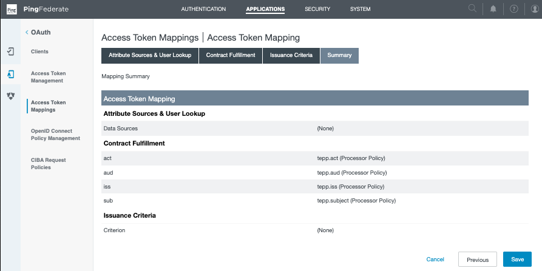

#### 3.6 Create the MCP Server Confidential Client

This step registers the MCP server as a confidential client authorized to perform token exchange.

- From the PingFederate console: navigate to Applications $\rightarrow$ OAuth $\rightarrow$ Clients
- Create a confidential client (set client authentication to client secret)
- Give the client the token exchange grant type
- For the token exchange field, set the processor policy to be the TEPP made in step 3.2

## 🚀 Deploy to Cloudflare

1. First, install dependencies and deploy the MCP server
    ```zsh
    npm install
    npm run deploy
    ```

2. Next, setup the remote environment variables using wrangler

    | Name | Description | Example |
    | :--- | :--- | :--- |
    | PING_FEDERATE_ISSUER | PingFederate server domain | `https://<ENV>.com:9031` |
    | MCP_SERVER_URL | URL of the deployed MCP server | `https://remote-mcp-ping-federate.<ENV>.workers.dev` |
    | MCP_SERVER_CLIENT_ID | ID of the MCP server client | `mcp_server` |
    | MCP_SERVER_CLIENT_SECRET | Secret of the MCP server client | `[A long, random, alphanumeric string]` |
    | API_URL | URL of the downstream Todo API | `https://todo-api-ping-federate.<ENV>.workers.dev` |

    ```zsh
    wrangler secret put PING_FEDERATE_ISSUER
    wrangler secret put MCP_SERVER_URL
    wrangler secret put MCP_SERVER_CLIENT_ID
    wrangler secret put MCP_SERVER_CLIENT_SECRET
    wrangler secret put API_URL
    ```

3. Lastly, make sure the `aud` is correct in the subject token mapping (PingFederate Configuration step 2.3)

## 🤖 Testing the MCP Server with the Cloudflare Workers AI LLM Playground

Navigate to [https://playground.ai.cloudflare.com](https://playground.ai.cloudflare.com) and connect to your MCP server using the following URL pattern:

```
https://remote-mcp-ping-federate.<ENV>.dev/mcp
```

### Validating DCR

This verification step observes how the mcp client (an unregistered client) establishes a secure connection. This sequence confirms the DCR setup is operational.

1. MCP client attempts an initial, unauthenticated request to the MCP resource endpoint (`<mcp_server>/mcp`)
2. MCP server responds with the protected resource metadata, triggering the discovery process
3. MCP client consumes the metadata, performs discovery of the authorization server, and self-registers with PingFederate as a public OIDC client
3. MCP client initiates the OAuth authorization flow, securing the necessary user consent and establishing a stateful MCP connection

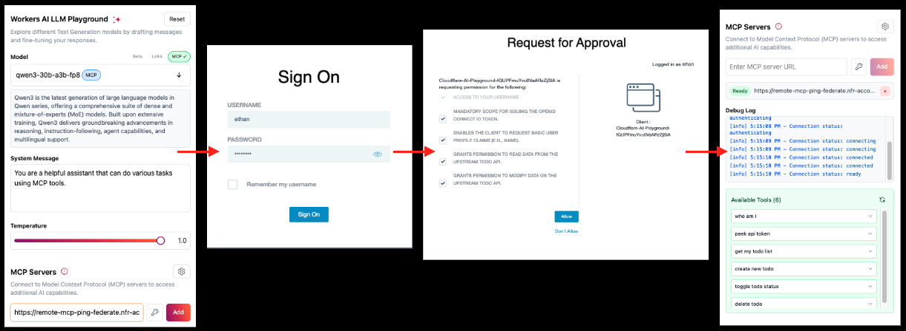

### Validating Token Exchange

This verification step observes how the MCP server performs token exchange to acquire a new token audienced for the downstream API. Using the `who_am_I` and `peek_api_tokens` tools, we will compare the two tokens.
- **Identical Identity:** Both tokens share the same `sub` claim, confirming they identify the same authenticated end user.
- **Delegation Proof:** The delegation token contains the `act` claim, identifying the MCP server as the trusted intermediary acting on the user's behalf.
- **Targeted Audience:** The subject token is audienced for the MCP server, while the delegation token is audienced for the downstream API.
- **Least Privilege:** The subject token retains the user's full, broader permissions. The delegation token is limited to only whats necessary for its target audience.

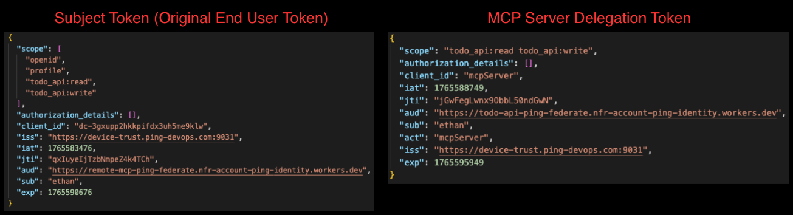
