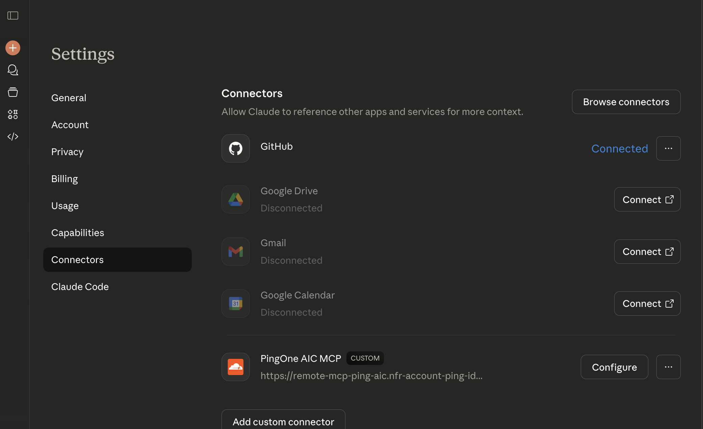
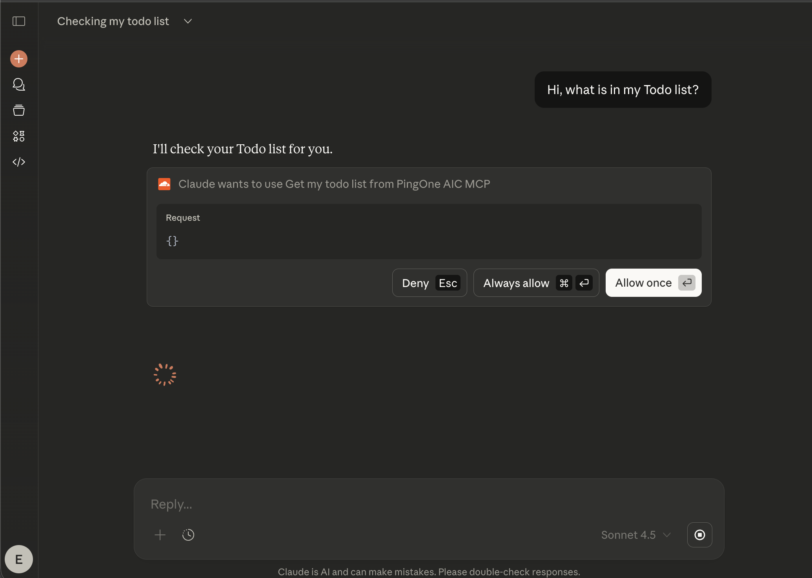
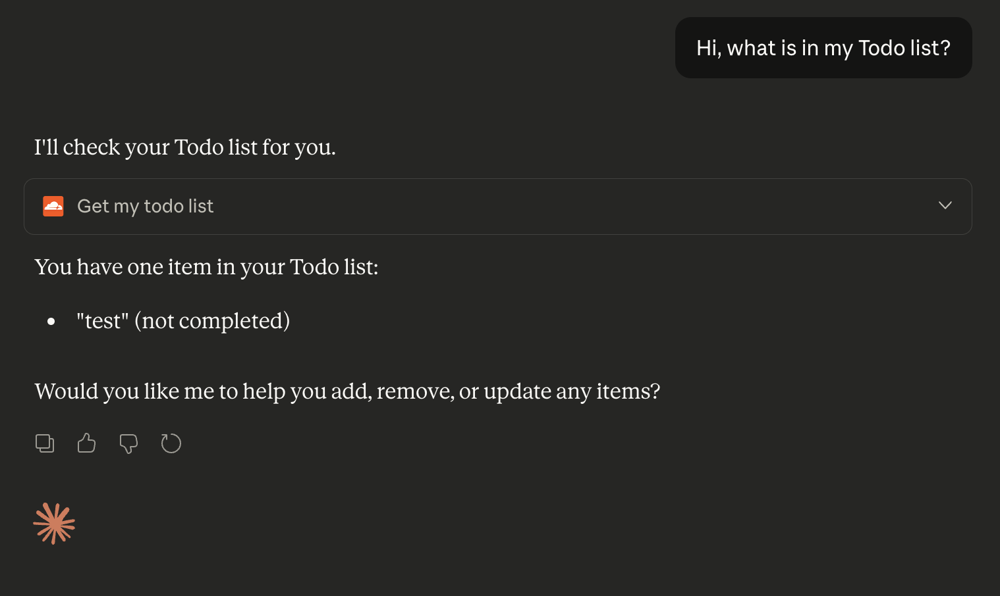

# Model Context Protocol (MCP) Server + PingOne AIC

This is a [Model Context Protocol (MCP)](https://modelcontextprotocol.io/introduction) server that supports remote MCP connections, with PingOne Advanced Identity Cloud built in.

Powered by [Cloudflare Workers](https://developers.cloudflare.com/workers/), the MCP server functions as a resource server within the OAuth architecture. It validates incoming requests and facilitate token exchange, ensuring secure communication between the MCP client and downstream APIs.

> [!WARNING]
> This is a demo template designed to help you get started quickly. While we have implemented several security controls, **you must implement all preventive and defense-in-depth security measures before deploying to production**. Please review the MCP spec: [Security Best Practices](https://modelcontextprotocol.io/specification/2025-11-25/basic/security_best_practices)

## Getting Started

This demo shows how an MCP server can securely call a protected API on behalf of an end user. To begin:

1. Deploy the [Todo API](./api/)
2. Deploy the [MCP server](./mcp/)

> [!NOTE]
> The API used here could be any PingOneAIC-secured API. We use a Cloudflare workers API for this example, but the goal is to demonstrate how any API can be connected to an MCP server using this architecture.

### Access the remote MCP server from Claude Code

Open Claude Code and navigate to Settings -> Connectors -> Add custom connector. 

Add the MCP server URL to the list of connectors.

Once connected you can ask Claude to use them. For example: "Could you tell me what is in my Todo list?". Claude should invoke the tool and show the result generated by the MCP server.

## How does it work?

This architecture bridges the stateless nature of Cloudflare workers with the stateful requirements of an authenticated MCP session.

### Authentication & Client Bootstrapping

When an unregistered MCP client tries to connect to the MCP server without a token, the server provides the necessary details for the client to perform Dynamic Client Registration (DCR) on the fly. This allows the client to handle the user login and consent via PingOne AIC automatically, provisioning the tokens required to both connect to the MCP server and for the MCP server to execute delegated token exchanges.

> [!NOTE]
> This implementation utilizes Dynamic Client Registration (DCR) to handle client onboarding. While the MCP protocol recommends CIMD as the new standard, DCR remains the only production-ready option currently supported by enterprise identity providers like PingOne AIC. Future versions of this architecture may transition to CIMD as support becomes available.

### Cloudflare Agents (State & Transport)

The MCP server extends the McpAgent class, which automatically wraps the MCP logic in a durable object. This handles the complex infrastructure requirements:
- **Session Persistence:** It creates a dedicated, isolated environment for each MCP connection and securely persists the PingOne AIC tokens in the durable object's storage (`this.props`).
- **Network Transport:** The agent manages the raw HTTP connection. It accepts incoming requests and keeps the response open as a Server-Sent Events (SSE) stream, enabling the Durable Object to push real-time updates back to the client over the single endpoint.

### MCP SDK (Tool Logic)

The official `@modelcontextprotocol/sdk` is used to define the actual capabilities of the MCP server. Inside the agent, an McpServer instance:
- **Handles Protocol:** Manages the serialization of JSON-RPC messages and tool definitions.

## Use Cases & Extensibility

This architecture demonstrates a pattern for connecting AI agents to APIs protected by PingOne AIC. The remote MCP server enables LLMs to interact with APIs on behalf of an authenticated user, without requiring modifications to the target API's existing permission models. By leveraging standard OAuth 2.0 patterns like Dynamic Client Registration (DCR) and Token Exchange, this project provides a blueprint for enabling natural language interactions with enterprise data while enforcing identity-based access controls and consent.