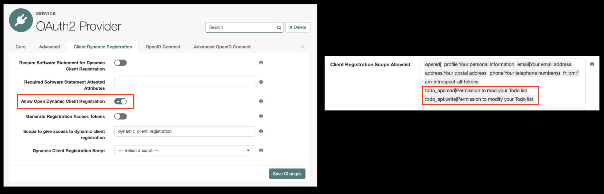
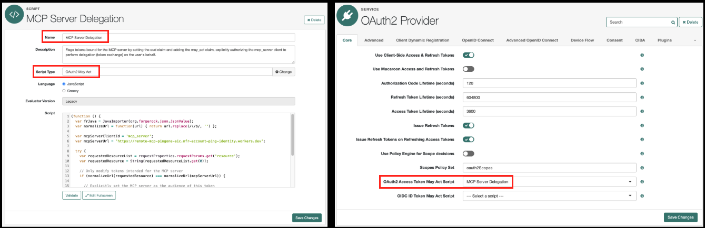
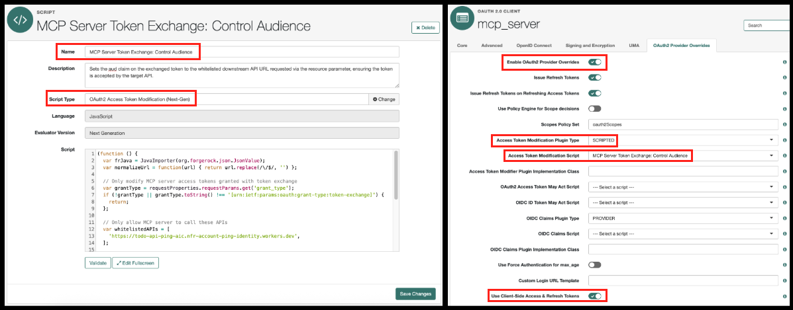
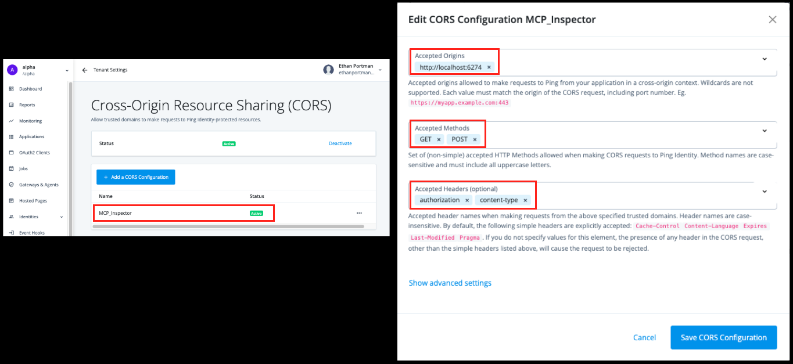
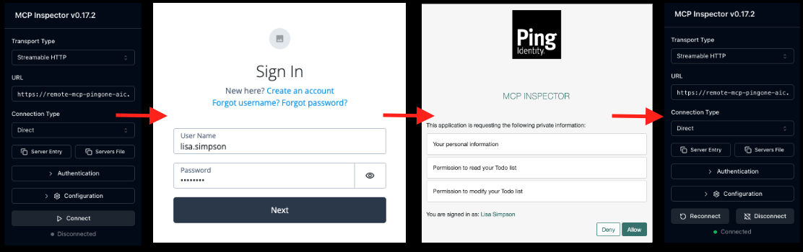

# MCP Server Secured with PingOne AIC

Cloudflare Workers MCP server secured with PingOne Advanced Identity Cloud (AIC). This MCP server enables AI agents (MCP clients) to call a protected API on behalf of an authenticated end user.

### Stack

| Role | Name | Description |
| :--- | :--- | :--- |
| **Platform** | [Cloudflare Workers](https://workers.cloudflare.com) | Serverless execution |
| **Framework** | [Hono](https://hono.dev) | Lightweight API endpoints |
| **Agent Execution** | [Cloudflare Agents SDK](https://developers.cloudflare.com/agents) | Base class for implementing the stateful MCP server |
| **Session State** | [Cloudflare Durable Objects](https://developers.cloudflare.com/durable-objects) | Provides stateful, isolated storage for each MCP connection |

### Requirements

* Node.js (v20+)
* PingOne Advanced Identity Cloud tenant
* Cloudflare account & [Wrangler CLI](https://developers.cloudflare.com/workers/wrangler/install-and-update)
* [Todo API](../api) deployed

### Structure

```text
mcp/
├── package.json               # Dependencies and scripts
├── tsconfig.json              # TypeScript compiler settings
├── wrangler.jsonc             # Worker configuration
└── src/
    ├── index.ts               # Defines the HTTP interface, handling MCP server discovery and MCP server routing
    ├── mcp.ts                 # Stateful MCP server as a cloudflare McpAgent (durable object)
    ├── config.ts              # Worker bindings and durable object session data
    ├── auth.ts                # Manages auth middleware and executes token exchange (delegation grant)
    └── todoApi.client.ts      # HTTP client to the downstream Todo API
```

## 🔒 PingOne AIC Configuration

### 1. Enable Dynamic Client Registration (DCR) for MCP Client Onboarding

This step allows MCP clients to automatically register themselves as public OIDC clients and request the necessary scopes to call the downstream Todo API. The MCP client will use the MCP server's protected resource metadata to determine how to register and what scopes to request.

1. From the Access Management Console: navigate to Services $\rightarrow$ OAuth2 Provider
2. In the **Client Dynamic Registration** tab, enable open DCR
3. In the **Advanced** tab, whitelist the Todo API scopes



### 2. Configure MCP Server for Token Exchange (Delegation)

These next steps setup the MCP server as a delegate, authorizing it to act on the end user's behalf. This allows the MCP server to swap the end user's token for a new token used to call the downstream Todo API. This new token is properly audienced for the target API and includes the `act` claim, identifying the MCP server as the trusted intermediary.

#### 2.1 Base MCP Server Setup to Perform Token Exchange

First, we need to give the MCP server two grant types: Client credentials to get its own identity token, and token exchange to perform the delegation swap. Scopes are also set here to limit the permissions the MCP server is allowed to obtain.

1. From the Access Management Console: navigate to Applications $\rightarrow$ OAuth 2.0 $\rightarrow$ Clients
1. Create a new client for the MCP server
2. In the **Advanced** tab, set the grant type to `Token Exchange` and `Client Credentials`
3. In the **Core** tab, set the scopes to the maximum allowable permissions


#### 2.2 Flag Eligable Tokens for Token Exchange via the `may_act` Claim

Next, we must run a script upon user token issuance to inject a claim designating the MCP server as the trusted delegate. Because DCR prevents us from knowing the MCP client's client ID, the script will be applied to all tokens but include safeguards to only target access tokens intended for the MCP server.

1. From the Access Management Console: navigate to Services $\rightarrow$ OAuth2 Provider $\rightarrow$ Scripts
2. Create a new Script of type **OAuth2 May Act**
3. Copy and paste the following script below, ensuring the placeholder values are replaced with your actual configuration values
4. From the Access Management Console: navigate to Services $\rightarrow$ OAuth2 Provider
5. In the **Core** tab, set the OAuth2 Access Token May Act Script

```javascript
(function () {
  var frJava = JavaImporter(org.forgerock.json.JsonValue);
  var normalizeUrl = function(url) { return url.replace(/\/$/, '') };

  var mcpServerClientId = 'MCP_SERVER_CLIENT_ID';  // placeholder
  var mcpServerUrl = 'URL_OF_DEPLOYED_MCP_SERVER'; // placeholder
 
  try {
    var requestedResourceList = requestProperties.requestParams.get('resource');
    var requestedResource = String(requestedResourceList.get(0));

    // Only modify tokens intended for the MCP server
    if (normalizeUrl(requestedResource) === normalizeUrl(mcpServerUrl)) {

      // Explicitly set the MCP server as the audience of this token
      token.setField("aud", mcpServerUrl);

      // Authorize MCP server to exchange this token
      var mayAct = frJava.JsonValue.json(frJava.JsonValue.object());
      mayAct.put('client_id', mcpServerClientId);
      mayAct.put('sub', mcpServerClientId);
      token.setMayAct(mayAct);
    };
  } catch (error) {};
}());
```



#### 2.3 Control Exchanged Token Audience with an Access Token Modification Script

The final step is to ensure the downstream API accepts the exchanged token. Since PingOne AIC does not automatically set the necessary audience claim during token exchange, we use an access token modification script tied specifically to the MCP server's client profile.

1. From the Access Management Console: navigate to Services $\rightarrow$ OAuth2 Provider $\rightarrow$ Scripts
2. Create a new Script of type **OAuth2 Access Token Modification (Next Gen)**
3. Copy and paste the following script below, replacing the placeholder with your actual downstream API URL
4. From the Access Management Console: navigate to Applications $\rightarrow$ OAuth 2.0 $\rightarrow$ Clients
5. Select your MCP server client
6. In the **OAuth2 Provider Overrides** tab, enable overrides and set the Access Token Modification Script

```javascript
(function () {
  var frJava = JavaImporter(org.forgerock.json.JsonValue);
  var normalizeUrl = function(url) { return url.replace(/\/$/, '') };

  // Only modify MCP server access tokens granted with token exchange
  var grantType = requestProperties.requestParams.get('grant_type');
  if (!grantType || grantType.toString() !== '[urn:ietf:params:oauth:grant-type:token-exchange]') {
    return;
  };

  // Only allow MCP server to call these APIs
  var whitelistedAPIs = [
    'URL_OF_DEPLOYED_API', // placeholder
  ];

  try {
    var requestedResourceList = requestProperties.requestParams.get('resource');
    var requestedResource = JSON.stringify(requestedResourceList).slice(2, -2);

    for (var i = 0; i < whitelistedAPIs.length; i++) {
      var whitelistedApi = normalizeUrl(whitelistedAPIs[i])
      if (normalizeUrl(requestedResource) === whitelistedApi) {
        // Resulting token will be audienced for the requested & whitelisted API
        accessToken.setField("aud", whitelistedApi);
        break;
      };
    };
  } catch (error) {};
}());
```



### 3. Setup Cross-Origin Resource Sharing (CORS)

For external MCP clients to communicate with PingOne AIC during the OAuth process, the client's origin must be explicitly whitelisted. Let's go ahead and whitelist our MCP inspector.

1. Navigate to the PingOne AIC dashboard.
2. Select `Tenant Settings`$\rightarrow$`Global Settings`.
2. Choose `Cross-Origin Resource Sharing (CORS)`.
4. Click `Add a CORS Configuration`.
3. Configure the rule specifically for the local MCP Inspector using its default address:



## 🚀 Deploy to Cloudflare

1. First, install dependencies and deploy the MCP server
```zsh
npm install
npm run deploy
```

2. Next, setup the remote environment variables using wrangler

| Name | Description | Example |
| :--- | :--- | :--- |
| PING_AIC_ISSUER | PingOne AIC environment domain | `https://<ENV>.forgeblocks.com:443/am/oauth2/alpha` |
| MCP_SERVER_URL | URL of the deployed MCP server | `https://remote-mcp-ping-aic.<ENV>.workers.dev` |
| MCP_SERVER_CLIENT_ID | ID of the MCP server client | `mcp_server` |
| MCP_SERVER_CLIENT_SECRET | Secret of the MCP server client | `[A long, random, alphanumeric string]` |
| API_URL | URL of the downstream Todo API | `https://todo-api-ping-aic.<ENV>.workers.dev` |

```zsh
wrangler secret put PING_AIC_ISSUER
wrangler secret put MCP_SERVER_URL
wrangler secret put MCP_SERVER_CLIENT_ID
wrangler secret put MCP_SERVER_CLIENT_SECRET
wrangler secret put API_URL
```

3. Lastly, make sure the `mcpServerUrl` is correct in the AIC may_act scriot (PingOne AIC Configuration step 2.2)

## 🤖 Testing the MCP Server with the MCP Inspector

It's time to validate the deployed MCP server. To begin, launch the Inspector:

```zsh
npx @modelcontextprotocol/inspector
```

The Inspector will start on port 6277, which we previously whitelisted in the CORS configuration.

### Validating DCR

This verification step observes how the inspector (an unregistered client) establishes a secure connection. This sequence confirms the DCR setup is operational.

1. MCP inspector attempts an initial, unauthenticated request to the MCP resource endpoint (`<mcp_server>/mcp`)
2. MCP server responds with the protected resource metadata, triggering the discovery process
3. MCP inspector consumes the metadata, performs discovery of the authorization server, and self-registers with PingOne AIC as a public OIDC client
3. MCP inspector initiates the OAuth authorization flow, securing the necessary user consent and establishing a stateful MCP connection



### Validating Token Exchange

This verification step observes how the MCP server performs token exchange to acquire a new token audienced for the downstream API. Using the `who_am_I` and `peek_api_token_claims` tools, we will compare the two tokens.
- **Identical Identity:** Both tokens share the same `sub` claim, confirming they identify the same authenticated end user.
- **Delegation Proof:** The subject token contains the `may_act` claim, explicitly authorizing the MCP server for exchange. The resulting delegation token contains the `act` claim, identifying the MCP server as the trusted intermediary acting on the user's behalf.
- **Targeted Audience:** The subject token is audienced for the MCP server, while the delegation token is audienced for the downstream API.
- **Least Privilege:** The subject token retains the user's full, broader permissions. The delegation token is limited to only whats necessary for its target audience.


