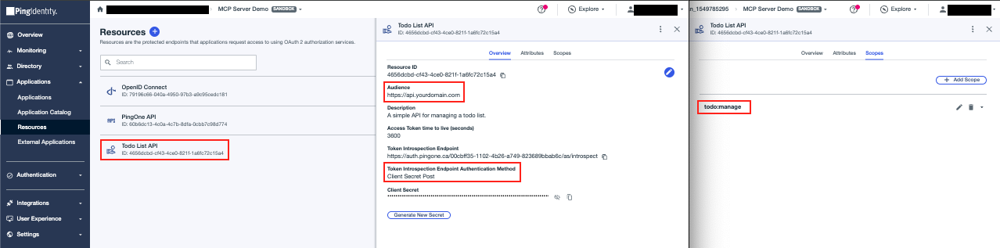

# Todo API

A protected API providing basic Todo CRUD. Access is granted only with a PingOne token.

### Stack

| Role | Name | Description |
| :--- | :--- | :--- |
| **Platform** | [Cloudflare Workers](https://workers.cloudflare.com) | Serverless execution |
| **Framework** | [Hono](https://hono.dev) | Lightweight API endpoints |
| **Data Storage** | [Cloudflare Workers KV](https://developers.cloudflare.com/kv) | User-scoped Todo list data |

### Requirements

* Node.js (v20+)
* PingOne environment
* Cloudflare account & [Wrangler CLI](https://developers.cloudflare.com/workers/wrangler/install-and-update)

### Structure

```text
api/
├── src/
│   ├── index.ts              # Worker entry point, defines the routes
│   ├── config.ts             # Worker bindings, request-scoped variables, and scopes
│   ├── todoService.ts        # Todo CRUD with Cloudflare KV
│   └── auth.ts               # PingOne token verification
├── package.json              # Dependencies and scripts
├── tsconfig.json             # TypeScript compiler settings
└── wrangler.jsonc            # Worker configuration
```

## 🔒 PingOne Configuration

**Configure the API's audience and supported scopes in PingOne**

- **Name:** `Todo List API`
- **Audience:** `https://todo.api.com`
- **Scopes:** `todo_api:read todo_api:write`



## 🚀 Deploy to Cloudflare

1. Install dependencies and build
    ```zsh
    npm install
    npm run build
    ```

2. Set remote environment variables

    | Name | Description | Example |
    | :--- | :--- | :--- |
    | API_ISSUER | PingOne environment domain | `https://auth.pingone.<REGION>/<ENV_ID>/as` |
    | API_AUDIENCE | `aud` claim this API expects in JWTs | `https://api.yourdomain.com` |

    ```bash
    wrangler secret put API_ISSUER
    wrangler secret put API_AUDIENCE
    ```

3. Configure remote KV storage

    ```bash
    wrangler kv namespace create TODO_KV_PINGONE
    ```

    > Note: After running this command, you must update `wrangler.jsonc` with the generated KV namespace ID

4. Deploy

    ```bash
    npm run deploy
    ```
