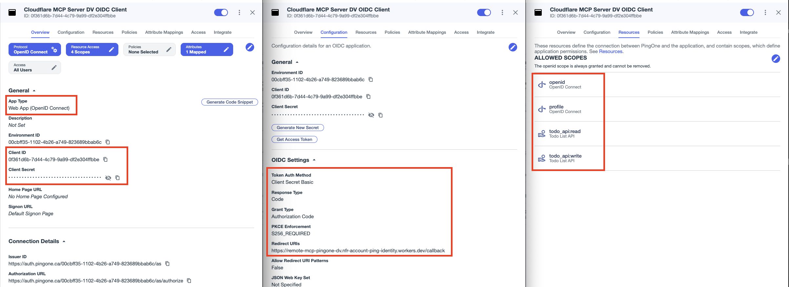
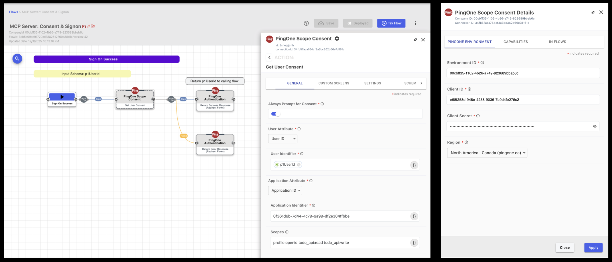
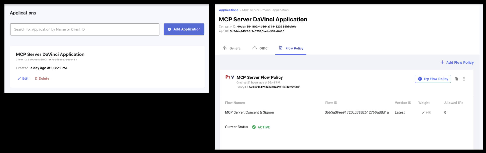
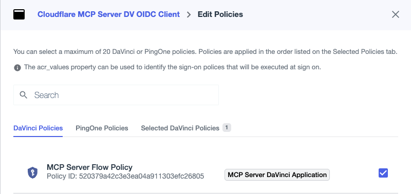
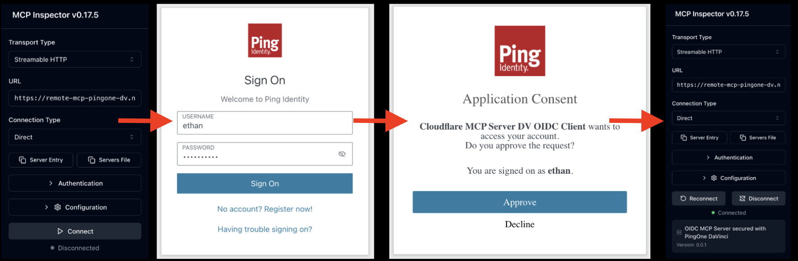

# OIDC MCP Server Secured with PingOne DaVinci

Cloudflare Workers MCP server secured using the Cloudflare Workers OAuth Provider, which delegates consent and authentication to PingOne DaVinci. This MCP server enables AI agents (MCP clients) to call a protected API on behalf of an authenticated end user.

> [!IMPORTANT]
> While serving as a resource server for MCP clients, this MCP server also fulfills two distinct OAuth roles:
>
> * Acts as an _OAuth Server_ to your MCP clients
> * Acts as an _OIDC Client_ to your PingOne environment

### Stack

| Role | Name | Description |
| :--- | :--- | :--- |
| **Platform** | [Cloudflare Workers](https://workers.cloudflare.com) | Serverless execution |
| **Framework** | [Hono](https://hono.dev) | Lightweight API endpoints |
| **Agent Execution** | [Cloudflare Agents SDK](https://developers.cloudflare.com/agents) | Base class for implementing the stateful MCP server |
| **Session State** | [Cloudflare Durable Objects](https://developers.cloudflare.com/durable-objects) | Provides stateful, isolated storage for each MCP connection |
| **OAuth Core** | [Cloudflare Workers OAuth Provider](https://github.com/cloudflare/workers-oauth-provider) | Orchestrates the OAuth flow, delegating consent/authentication to PingOne |
| **Ephemeral State** | [Cloudflare Workers KV](https://developers.cloudflare.com/kv) | Stores OAuth state required by the workers oauth provider |

### Requirements

* Node.js (v20+)
* PingOne environment with DaVinci
* Cloudflare account & [Wrangler CLI](https://developers.cloudflare.com/workers/wrangler/install-and-update)
* [Todo API](../api) deployed
* [MCP Inspector](https://modelcontextprotocol.io/docs/tools/inspector)

### Structure

```text
mcp/
├── package.json                     # Dependencies and scripts
├── tsconfig.json                    # TypeScript compiler settings
│── wrangler.jsonc                   # Worker configuration
└── src/
    ├── index.ts                     # OAuth server flow and MCP server routing
    ├── mcp.ts                       # Stateful MCP server as a Cloudflare McpAgent (durable object)
    ├── config.ts                    # Worker bindings and Cloudflare durable object session data
    ├── todoApi.client.ts            # HTTP client to the downstream Todo API
    └── auth/
        ├── workers-oauth-utils.ts   # Cloudflare OAuth utility functions
        ├── ping-handler.ts          # Endpoints that connect the auth flow between OAuth provider and PingOne
        ├── ping-utils.ts            # PingOne OAuth utility functions
        └── ping-types.ts            # PingOne OAuth types
```

> Note: The `workers-oauth-utils.ts` file was copied from the Github and Google examples, with unused code removed.

## 🔒 PingOne Configuration

### 1. Register the MCP Server as an OIDC Client

This step enables the Cloudflare worker to exchange authorization codes on behalf of the end user. It is important to note that it is the MCP server, not the MCP client, that receives the PingOne access token. The MCP server will then issue a seperate reference token to the MCP client for session lookups. This distinction ensures proper audience scoping: the MCP client token is intended for the MCP server, while the MCP server token is intended for the target API. Follow the below steps to configure the MCP server as an OIDC client.

1. In the PingOne console, add a new application, select web app (openID connect), and ensure the grant type is set to authorization code with PKCE enforcement (S256).
2. Set the Redirect URI to your Cloudflare worker’s callback endpoint (e.g., `<mcp_server>/callback`). If the worker is not yet deployed, use a placeholder and update it later.
3. Navigate to the resources tab and assign the standard OIDC scopes (openid, profile) along with the API scopes (todo:read, todo:write).
4. Leave the policy blank for now, as this will be handled in a later step.



### 2. Create a Worker Application to Handle MCP Server Consent

The DaVinci [Scope Consent Connector](https://docs.pingidentity.com/connectors/p1_scope_consent_connector.html) enables flows to manage user consent. This connector requires a dedicated PingOne worker application with administrative privileges to access consent records. Follow the below steps to configure this worker as the MCP server consent service:

1. In the PingOne console, add a new application, select worker type, and ensure the authentication method is set to client secret basic.
2. Assign the `Environment Admin` and `Identity Data Admin` roles to the application to authorize the worker to manage user consent.


### 3. Create the DaVinci Flow using the MCP Server OIDC Client and the Consent Service Worker

This step creates the DaVinci flow that orchestrates both authentication and consent for the MCP server. We will modify a standard PingOne sign-on flow to include the consent logic.

1. In the DaVinci console, add the PingOne Scope Consent connector and configure it using the client ID and client secret from the consent service worker.
2. Navigate to flows and clone the `PingOne Sign On with Registration, Password Reset and Recovery` flow.
3. Locate the Sign on Success node and drop a Get User Consent node immediately after it.
4. Configure the Get User Consent node by entering the application ID of the MCP server OIDC client.
5. Configure the PingOne authentication terminal nodes and make sure the flow is a PingOne flow in the flow settings.



### 4. Create a DaVinci Policy for the DaVinci Flow

This step adds the DaVinci flow to an application and creates a flow policy to control how and when the flow gets used.

1. In the DaVinci console, navigate to applications and create a new application.
2. Add a PingOne flow policy to the application and target the DaVinci flow created in step 3.



### 5. Bind the PingOne DaVinci Policy to the MCP Server Client Profile

This final step ensures that when the MCP server initiates an OAuth request, PingOne routes the user through the DaVinci flow to capture the required consent.

1. In the PingOne dashboard, select the MCP server client created in step 1.
2. In the policies tab, attach the DaVinci Policy created in step 4



## 🚀 Deploy to Cloudflare

1. Install dependencies and build
    ```zsh
    npm install
    npm run build
    ```

2. Set remote environment variables using wrangler

    | Name | Description | Example |
    | :--- | :--- | :--- |
    | PINGONE_ISSUER | PingOne environment domain | `https://auth.pingone.<REGION>/<ENV_ID>/as` |
    | PINGONE_DV_POLICY_ID | DaVinci policy ID | `8b560eda9614e47d163c8bb92750ac3b` |
    | MCP_SERVER_CLIENT_ID | ID of the MCP server client | `0c24f3a0-0522-4f76-9bcf-89643029e3e0` |
    | MCP_SERVER_CLIENT_SECRET | Secret of the MCP server client | `[A long, random, alphanumeric string]` |
    | API_IDENTIFIER | ID of the downstream Todo API resource | `https://todo.api.com` |
    | API_URL | URL of the downstream Todo API | `https://todo-api-ping-aic.<ENV>.workers.dev` |
    | COOKIE_ENCRYPTION_KEY | Key used to sign browser cookies | `[A long, random, base64 string]` |

    ```bash
    wrangler secret put PING_AIC_ISSUER
    wrangler secret put PINGONE_DV_POLICY_ID
    wrangler secret put MCP_SERVER_CLIENT_ID
    wrangler secret put MCP_SERVER_CLIENT_SECRET
    wrangler secret put API_IDENTIFIER
    wrangler secret put API_URL
    wrangler secret put COOKIE_ENCRYPTION_KEY
    ```

3. Configure remote KV storage using wrangler

    ```bash
    wrangler kv namespace create OAUTH_KV
    ```

    > Note: After running this command, you must update `wrangler.jsonc` with the generated KV namespace ID

4. Deploy

    ```bash
    npm run deploy
    ```

## 🤖 Test the MCP Server with the MCP Inspector

The MCP Inspector is a developer tool that allows you to test and debug MCP servers by simulating a client connection. This enables you to validate the authentication flow and tool execution interactively. To get started, launch the inspector:

```zsh
npx @modelcontextprotocol/inspector
```

The Inspector will start on port 6277. No CORS rules are needed because the authentication occurs server-to-server (MCP Server $\to$ PingOne), bypassing browser restrictions.

### Validating Authentication

This process validates the authentication sequence between the Inspector and the MCP server. It confirms that the Cloudflare OAuth Provider successfully delegates the authentication and consent flow to PingOne DaVinci.

1. **Connection:** The Inspector initiates a request to the MCP endpoint (`<mcp_server>/mcp`).
2. **Delegation:** The MCP server intercepts the request and redirects the user to the PingOne DaVinci flow.
3. **Consent:** The user authenticates and grants consent directly within the DaVinci interface.
4. **Exchange:** The MCP server exchanges the returned authorization code for an downstream access token.
5. **Binding:** The server binds this downstream token to a new, isolated client session.
6. **Completion:** The server establishes the connection and issues a session handle to the Inspector.



### Validating Operation

This step verifies that the MCP server is working properly. Use the Inspector to confirm the following behaviour:

1. **First Run:** Connection initiates the full PingOne DaVinci login and consent sequence.
2. **Persistence:** Reconnecting recovers the existing session silently (depending on DaVinci consent settings).
3. **Manifest:** The server correctly populates the tool list in the Inspector.
4. **Context:** The whoAmI tool returns the PingOne access token audienced for the Todo API.
5. **Functionality:** Downstream API actions (adding/deleting todos) complete successfully.
