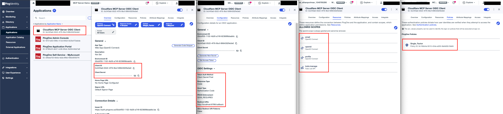
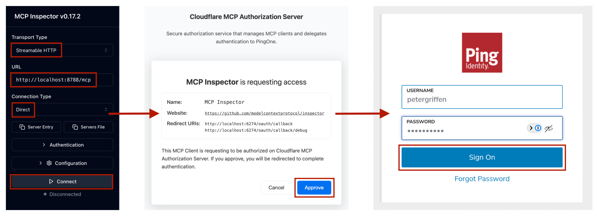

# OIDC MCP Server Secured with PingOne

Cloudflare MCP server secured using the Cloudflare Workers OAuth Provider, which delegates authentication to PingOne. This enables MCP clients to call the **[Todo API](../api/)** on a PingOne authenticated user's behalf.

> [!IMPORTANT]
> The MCP server operates as two distinct OAuth roles:
>
> * Acts as an _OAuth Server_ to your MCP clients
> * Acts as an _OIDC Client_ to your PingOne environment

### Stack

| Role | Name | Description |
| :--- | :--- | :--- |
| **Platform** | [Cloudflare Workers](https://workers.cloudflare.com) | Serverless execution |
| **Framework** | [Hono](https://hono.dev) | Lightweight API endpoints |
| **Agent Execution** | [Cloudflare Agents SDK](https://developers.cloudflare.com/agents) | Base class for managing stateful agent lifecycle |
| **MCP Protocol** | [MCP TypeScript SDK](https://www.npmjs.com/package/@modelcontextprotocol/sdk) | Implements the MCP specification |
| **OAuth Core** | [Cloudflare Workers OAuth Provider](https://github.com/cloudflare/workers-oauth-provider) | Orchestrates the OAuth 2.1 flow, delegating authentication to PingOne |
| **Ephemeral State** | [Cloudflare Workers KV](https://developers.cloudflare.com/kv) | Stores short-term, user-specific state required for OAuth flow validation |
| **Session State** | [Cloudflare Durable Objects](https://developers.cloudflare.com/durable-objects) | Stores long-term, user-specific session data, including the PingOne tokens |

### Requirements

* **Node.js (v20+)**
* **PingOne Environment**
* **Cloudflare Account & [Wrangler CLI](https://developers.cloudflare.com/workers/wrangler/install-and-update/)**
* **[Todo API](../api) running or deployed**
* **[MCP Inspector](https://modelcontextprotocol.io/docs/tools/inspector)**

### Structure

```text
mcp/
├── src/
│   ├── index.ts                     # Cloudflare MCP server wrapped in a Cloudflare OAuth provider
│   ├── config.ts                    # Worker bindings and Cloudflare durable object session data
│   ├── todoApi.client.ts            # HTTP client to the upstream Todo API
│   └── auth/
│       ├── workers-oauth-utils.ts   # Cloudflare OAuth utility functions
│       ├── ping-handler.ts          # Endpoints that stitch together the flow between OAuth provider and PingOne
│       ├── ping-utils.ts            # PingOne OAuth utility functions
│       └── ping-types.ts            # PingOne OAuth types
├── package.json                     # Dependencies and scripts
├── tsconfig.json                    # TypeScript compiler settings
└── wrangler.jsonc                   # Worker configuration
```

> Note: The `workers-oauth-utils.ts` file was copied from the Github and Google examples.

## 🏁 Getting Started

### PingOne Configuration

**Define the OIDC application in the PingOne dashboard**
- **Name:** `Cloudflare MCP Server OIDC Client`
- **Token Auth Method:** `Client Secret Post`
- **Response Type:** `Code`
- **Grant Type:** `Authorization Code`
- **PKCE Enforcement:** `S256_REQUIRED`
- **Redirect URIs:** `http://localhost:8788/callback`
- **Allowed Scopes:** `email`, `openid`, `profile`, and `todo:manage`
- **Policy:** `Single_Factor`



### Environment Setup

```bash
cp .dev.vars.sample .dev.vars
```

| Name | Description | Example |
| :--- | :--- | :--- |
| PINGONE_ISSUER | PingOne environment domain | `https://auth.pingone.<REGION>/<ENV_ID>/as` |
| PINGONE_CLIENT_ID | ID of the MCP server OIDC application | `0c24f3a0-0522-4f76-9bcf-89643029e3e0` |
| PINGONE_CLIENT_SECRET | Secret of the MCP server OIDC application | `[A long, random, alphanumeric string]` |
| PINGONE_AUDIENCE | ID of the upstream Todo API resource | `https://api.yourdomain.com` |
| API_URL | URL of the upstream Todo API | `http://localhost:8787` OR `<deployed_api_url>` |
| COOKIE_ENCRYPTION_KEY | Key used to sign browser cookies | `[A long, random, base64 string]` |

### Run Locally

```bash
npm install
npm run build
npm run dev
```

### Test the MCP Server

The MCP Inspector allows you to test the MCP server from the perspective of an MCP client. You can start it with the following command:
```bash
npx @modelcontextprotocol/inspector
```

#### 1. MCP server authorization flow



#### 2. Connected session and tools


#### Expected behaviour:
1. Upon initial connection, the user consents with Cloudflare and authenticates with PingOne.
2. Upon reconnection, the session is recovered and there is no Cloudflare consent.
3. When the browser history is erased and a reconnect occurs, the Cloudflare consent reappears.
4. The MCP server exposes registered tools and their descriptions.
5. The whoAmI tool returns information about the authenticated user.
6. Todo list items can be added and deleted.

## 🚀 Deploy to Cloudflare

**1. Set remote environment variables**

```bash
wrangler secret put PINGONE_ISSUER
wrangler secret put PINGONE_CLIENT_ID
wrangler secret put PINGONE_CLIENT_SECRET
wrangler secret put PINGONE_AUDIENCE
wrangler secret put API_URL  # This cannot be localhost and must point to the deployed Todo API
wrangler secret put COOKIE_ENCRYPTION_KEY
```

> Note: When prompted to create a new worker during the first secret setup, submit "Y" to proceed and save the secret.

**2. Configure remote KV storage**

```bash
wrangler kv namespace create OAUTH_KV
```

> Note: After running this command, you must update `wrangler.jsonc` with the generated KV namespace ID.

**3. Deploy remote MCP server**

```bash
npm run deploy
```

**4. Update PingOne config**

After deploying the MCP server, the deployed URL must be added to the redirect URIs for the `Cloudflare MCP Server OIDC Client` in the PingOne dashboard.
