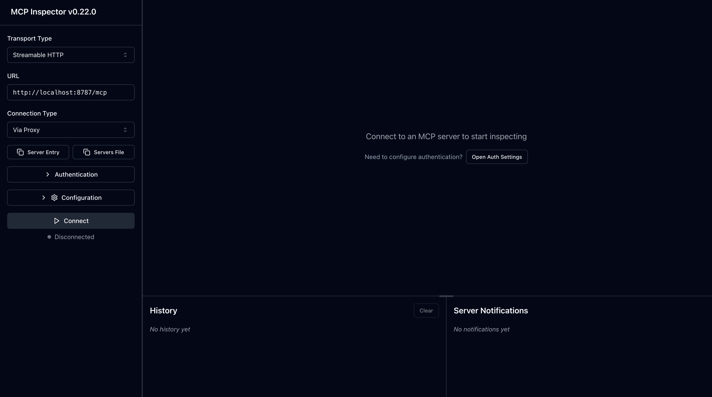

# Remote MCP Server with Descope Auth

Let's get a Remote MCP server up-and-running on Cloudflare Workers with Descope OAuth login!

> [!WARNING]
> This is a demo template designed to help you get started quickly. While we have implemented several security controls, **you must implement all preventive and defense-in-depth security measures before deploying to production**. Please review our comprehensive security guide: [Securing MCP Servers](https://github.com/cloudflare/agents/blob/main/docs/securing-mcp-servers.md)

## Prerequisites

Before you begin, ensure you have:

- A [Descope](https://www.descope.com/) account
- A Descope **Agentic Identity Hub MCP Server** resource, and a **Client** bound to it (created in [Agentic Identity Hub → MCP Servers](https://app.descope.com/) — see below)
- Node.js version `18.x` or higher
- A Cloudflare account (for deployment)

## Develop locally

1. Create an MCP Server resource and a Client in the Descope Console:
    - Go to **Agentic Identity Hub → MCP Servers** and create a new MCP Server. Set its **MCP Server URL** to `http://localhost:8787/mcp` (add your deployed `https://<worker>.workers.dev/mcp` too when you deploy) — this value is included in the `aud` claim on issued access tokens.
    - Under that MCP Server, create a **Client**. Allow the Authorization Code grant type, and set the redirect / callback URL to `http://localhost:8787/callback` (add your deployed `https://<worker>.workers.dev/callback` too when you deploy).

      > A Client's MCP Server association is set when the client is created and cannot be changed afterward. If you need to bind an existing client to a different MCP Server, create a new client instead.

    - From the client's settings, copy the **Client ID** and **Client Secret** — these are the credentials this server uses to authorize against Descope.
    - **Define and grant the scopes** the server requests (in the MCP Server's Scopes section, then grant them to your client). This server asks for `openid profile email`, so define and grant:
        - `profile` → mapped to the `name` claim
        - `email` → mapped to the `email` claim
        - (`openid` is implicit and does not need to be defined.)

    > Scopes requested at `/authorize` **must** be defined on the MCP Server and explicitly granted to the requesting client, or Descope rejects the request (`Received invalid scope`). The `openid` scope is required for Descope to issue an `id_token`; this server reads `name`/`email` from that signature-verified `id_token`, not from a `/userinfo` call — the `/userinfo` endpoint does not resolve applications identified by the Agentic Identity Hub's issuer format.

    > [!CAUTION]
    > This MCP Server has Dynamic Client Registration (DCR) enabled by default. Without an approval step, any caller that can reach the registration endpoint can self-register a client and immediately request any scope the MCP Server defines, with no human review. If you want gating, configure a Client Registration Flow under **Agentic Identity Hub → MCP Servers → [your server] → Settings** to review, tag, verify, or block newly registered clients before they can sign users in.

2. Create a KV namespace for OAuth state storage:

```bash
npx wrangler kv namespace create OAUTH_KV
# Copy the ID and update wrangler.jsonc
```

3. Copy the `.dev.vars.example` file to `.dev.vars` and fill in your credentials:

```bash
# .dev.vars
DESCOPE_CLIENT_ID="your_client_id"
DESCOPE_CLIENT_SECRET="your_client_secret"
DESCOPE_PROJECT_ID="your_descope_project_id"
DESCOPE_MCP_SERVER_ID="your_descope_mcp_server_id"
DESCOPE_BASE_URL="https://api.descope.com"
DESCOPE_SCOPES="openid profile email"
DESCOPE_ENABLE_PKCE="false"
DESCOPE_RESOURCE="http://localhost:8787/mcp"
COOKIE_ENCRYPTION_KEY="your_cookie_encryption_key"
```

Generate the cookie encryption key:

```bash
openssl rand -hex 32
```

4. Clone and set up the repository:

```bash
# clone the repository
git clone git@github.com:cloudflare/ai.git

# install dependencies
cd ai
npm install

# run locally
npx nx dev remote-mcp-server-descope-auth
```

You should be able to open [`http://localhost:8787/`](http://localhost:8787/) in your browser

## Connect the MCP inspector to your server

To explore your new MCP api, you can use the [MCP Inspector](https://modelcontextprotocol.io/docs/tools/inspector).

1. Start it with `npx @modelcontextprotocol/inspector`
2. [Within the inspector](http://localhost:5173), set the Transport Type to `Streamable HTTP` and enter `http://localhost:8787/mcp` as the URL of the MCP server to connect to.
3. Click "Connect" (or run the **Quick OAuth Flow** from the Authentication panel). The inspector registers itself via Dynamic Client Registration, then redirects you to Descope to log in. This server is OAuth-protected — you do **not** paste a bearer token manually; the token is obtained through the OAuth flow.
4. After you authenticate, click "List Tools".
5. Run the "getUserInfo" tool to see your authenticated Descope profile, or "getToken" to see the Descope access token the server received.

<div align="center">
  
</div>

## Deploy to Cloudflare

1. Create a KV namespace for production:

```bash
npx wrangler kv namespace create OAUTH_KV
# Copy the returned ID into the production kv_namespaces binding in wrangler.jsonc
```

2. Set up your secrets in Cloudflare:

```bash
# Set Descope Agentic Identity Hub credentials as secrets
npx wrangler secret put DESCOPE_CLIENT_ID
npx wrangler secret put DESCOPE_CLIENT_SECRET
npx wrangler secret put DESCOPE_PROJECT_ID
npx wrangler secret put DESCOPE_MCP_SERVER_ID
npx wrangler secret put DESCOPE_BASE_URL # optional, defaults to https://api.descope.com
npx wrangler secret put COOKIE_ENCRYPTION_KEY
```

> [!IMPORTANT]
> After deploying, add your production callback URL (`https://<worker>.workers.dev/callback`) to the client's redirect URLs, and your production MCP Server URL (`https://<worker>.workers.dev/mcp`) to the MCP Server resource, under **Agentic Identity Hub → MCP Servers**.

3. Deploy the worker:

```bash
npm run deploy
```

## Call your newly deployed remote MCP server from a remote MCP client

Just like you did above in "Develop locally", run the MCP inspector:

```bash
npx @modelcontextprotocol/inspector@latest
```

Then, using the `Streamable HTTP` transport, enter the `workers.dev` URL (ex: `https://worker-name.account-name.workers.dev/mcp`) of your Worker in the inspector as the URL of the MCP server to connect to, and click "Connect".

You've now connected to your MCP server from a remote MCP client. Authentication runs through the Descope OAuth flow — no manual bearer token needed.

## Architecture

This server uses the **stateless MCP handler** from the [MCP SDK v2](https://developers.cloudflare.com/agents/model-context-protocol/guides/migrate-to-mcp-sdk-v2/) (protocol revision `2026-07-28`). Instead of the old stateful `McpAgent` Durable Object, requests are served by [`createMcpHandler`](https://developers.cloudflare.com/agents/model-context-protocol/mcp-handler-api/) from `agents/mcp/server` — so there is no Durable Object binding or migration to configure.


## Features

The MCP server implementation includes:

- ⚡ Stateless MCP SDK v2 handler (no Durable Object required)
- 🔐 OAuth 2.0/2.1 Authorization Server Metadata (RFC 8414)
- 🔑 Dynamic Client Registration (RFC 7591)
- 🔒 PKCE Support
- 📝 Bearer Token Authentication
